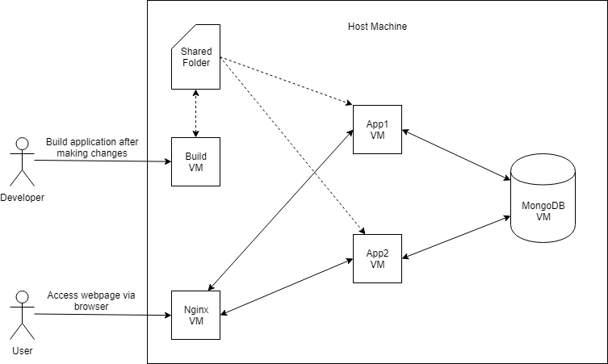
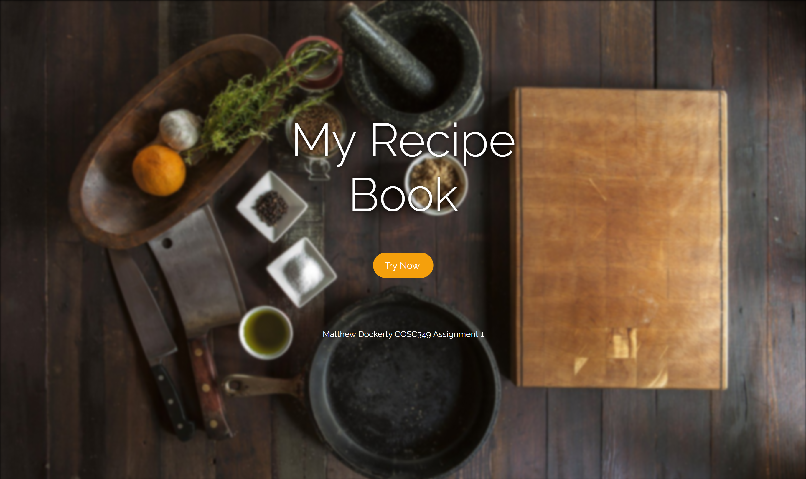
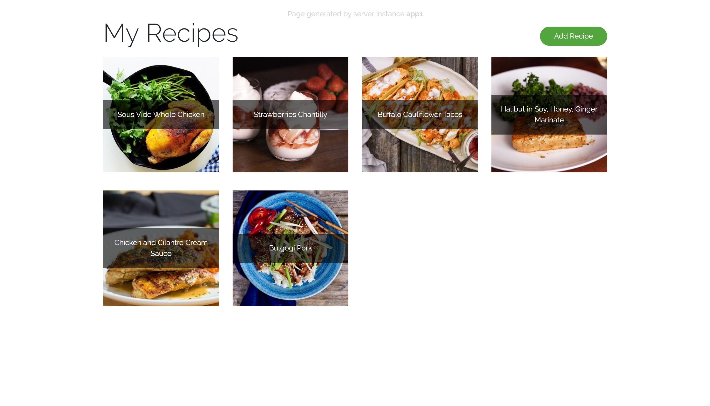
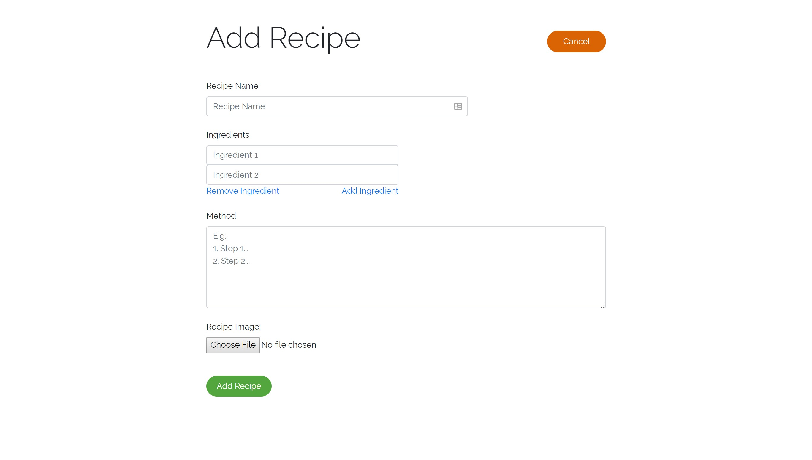
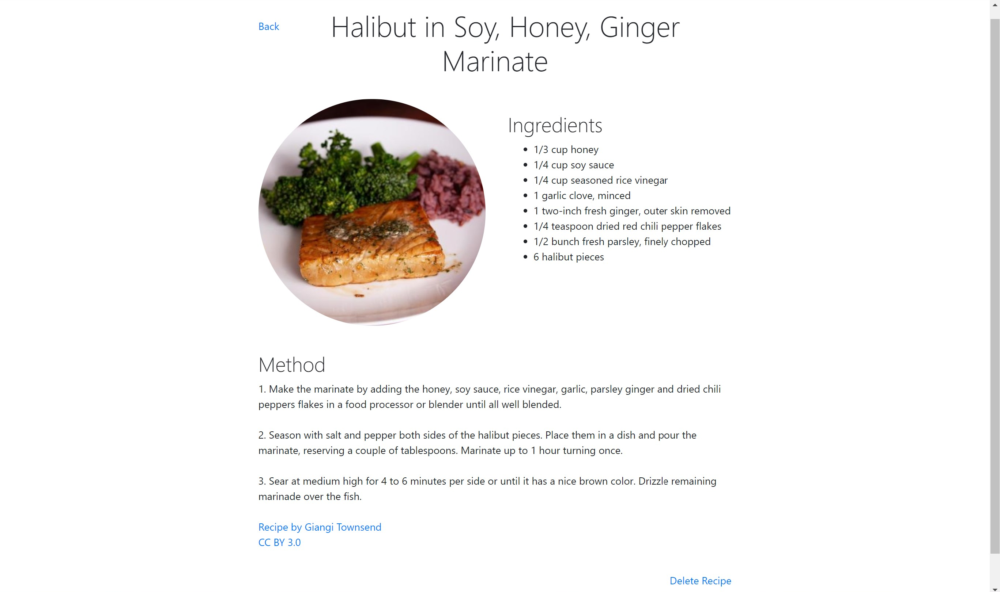

# COSC349 Assignment 1: Portable Software Application Deployment Using Virtualisation
COSC349 (Cloud Computing) is a new Computer Science paper at the University of Otago in 2019.

The purpose of this assignment was to design and develop an application whose build process relies on virtualisation. The application operates through the coordination of multiple virtual machines, managed by Vagrant.

In my implementation, I created a very simple recipe book webapp. The focus of this assignment was on the interactions between virtual machines and automated building and deployment, not the application itself.

## Getting Started
### Prerequisites
The only prerequisites required to build and deploy this application are [Vagrant](https://vagrantup.com) and a compatible virtual machine provider such as [VirtualBox](https://www.virtualbox.org/).

The project can be built on any host operating system as long as these two requirements are met.

### Running
Run the ```vagrant up``` command in the root project directory to start the virtual machines and deploy the project. If this has not been done before, the virtual machines will be created and provisioned. This may take some time...

Once this process has completed, the application will be available at [http://localhost:8080](http://localhost:8080).

### Building
The web application only needs to be rebuilt when Go source files have been changed. If any static resources or template files are changed, this will be immediately reflected.

Run the shell script ```hostbuild.sh``` on the host computer to re-build the application and restart the application services running on the virtual machines. This runs the following commands:
```
vagrant ssh build -c "exec /vagrant/build.sh"
vagrant ssh app1 -c "sudo systemctl restart app"
vagrant ssh app2 -c "sudo systemctl restart app"
```

## Architecture
This application makes use of 5 different virtual machines:
- Build server: Used for building the Go web application.
-	Nginx reverse proxy: Load balances requests between two web application instances.
- 2 Application servers: Provide the web application services & serve front-end files.
- MongoDB database: Used to persistently store recipe data.

The following diagram shows the interactions between the virtual machines


## Technologies Used
- Nginx
- Go
- Bootstrap
- Vagrant
- MongoDB

## Features
- Automated building & deployment
- Adding recipes
- Viewing all recipes
- Viewing specific recipes
- Deleting recipes

## Screenshots





## License
This project is licensed under the MIT License (see [LICENSE](/LICENSE))

## Acknowledgments
- David Eyers - COSC349 lecturer
- [foodista.com](https://www.foodista.com/) - CC BY 3.0 licensed recipes used in example data
